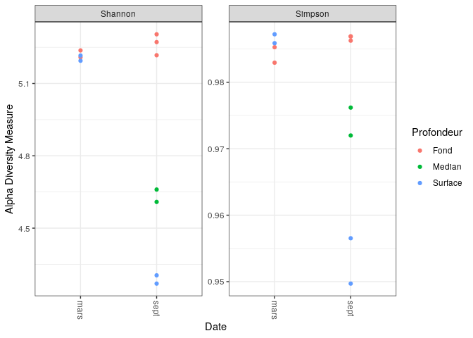
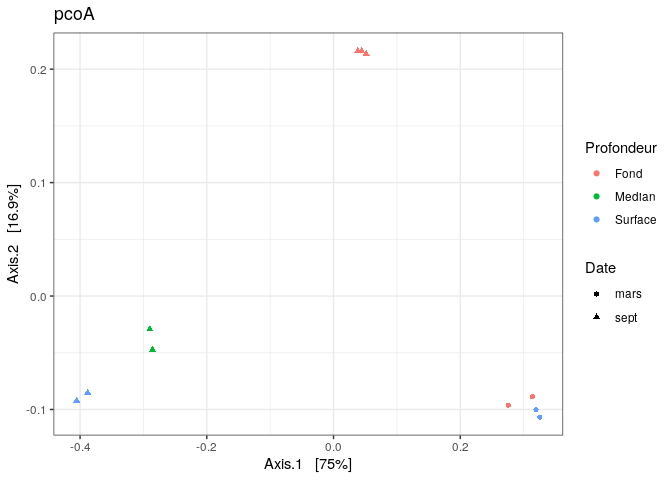
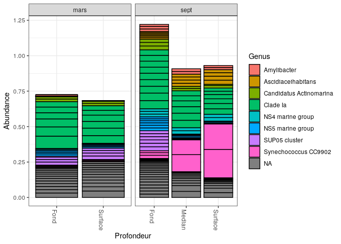
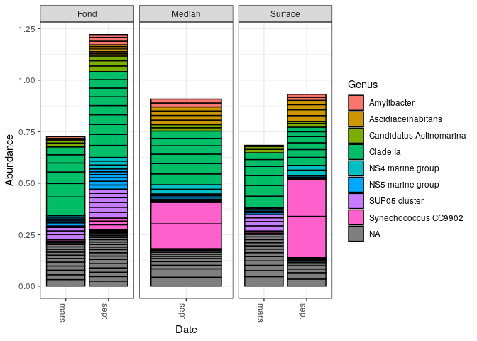

phyloseq
================

  - [Questions:](#questions)
      - [Importer dans phyloseq :](#importer-dans-phyloseq)
      - [Visualisez la diversité alpha
        :](#visualisez-la-diversité-alpha)
      - [Ordinate:](#ordinate)
      - [Bar plot :](#bar-plot)

# Questions:

1- quelles sont les influences relatives de la profondeur et de la
saison sur la structure des communautés planctoniques de la rade de
Brest? 2- Quels sont les biomarquers de la saison ?

## Importer dans phyloseq :

Ici on va appeler le package phyloseq, et ensuite savoir sa version. Ce
package permet d’importer, stocker, analyser et afficher graphiquement
des données de séquençage phylogénétique complexes qui ont déjà été
regroupées en unités taxonomiques opérationnelles (OTU):

``` r
library(phyloseq); packageVersion("phyloseq")
```

    ## [1] '1.32.0'

Ici on va Rapporter le numéro de version du Biostrings, ce package
permet une manipulation efficace des chaînes biologiques:

``` r
library(Biostrings); packageVersion("Biostrings")
```

    ## [1] '2.56.0'

Ici on va Rapporter le numéro de version du package ggplot2, ce package
permet la création déclarative de graphiques:

``` r
library(ggplot2); packageVersion("ggplot2")
```

    ## [1] '3.3.2'

La fonction theme\_set() permet de remplacer le thème actuel,et choisir
le thème classique dark-on light de ggplot2 qui pourrait mieux
fonctionner pour les présentations graphiques.

``` r
theme_set(theme_bw())
```

``` r
load("02_data-analysis")
```

Le but c’est de construire une matrice à partir des informations
encodées dans le fichier seqtab.mochim. Pour celà je vais créer une
variable sample.out contenant les noms des lignes se trouvant dans le
ficher seqtab.mochib en utilisant la fonction rawnames().

j’ai utilisé ensuite la fonction strsplit() qui va diviser le vecteur de
chaîne d’entrée samples.out en sous-chaînes. et puis sapply () qui va
prendre le résultat de la fonction strsplit() comme entrée et donne une
sortie une matrice. la variable profondeur va contenir toutes les noms
de lignes de fichiers seqtab.mochim. la variable date va contenir toute
les noms de lignes se trouvant dans profondeur. après je vais créer une
variable samdf qui va être une tableau contenant les deux variables
profondeur et date comme colonnes.

``` r
samples.out <- rownames(seqtab.nochim)
profondeur <- sapply(strsplit(samples.out, "D"), `[`, 1)
date <- substr(profondeur,0,11)
samdf <- data.frame(Profondeur=profondeur, Date=date)
```

Ici je voulais structurer mais donner dans le tableau, et comme je
savais pas comment faire cela de manière plus élégante avec moins de
ligne de code, j’ai fait ça comme ça, l’essentiel que ça marche :D Ces
lignes de code vont permettre de mettre fond median et surface dans les
lignes de la colonnes profondeur.

``` r
samdf$Profondeur[c(1:5)] <- ("Fond")
samdf$Profondeur[6:7] <- ("Median")
samdf$Profondeur[8:11] <- ("Surface")
```

Ces lignes de code vont permettre de mettre sept et mars dans les lignes
de la colonnes Date.

``` r
samdf$Date[c(1,3,4,5:8,10)] <- c("sept")
samdf$Date[c(2,4,9,11)] <- c("mars")
```

avec les lignes précédentes j’ai pu faire un tableau avec deux colonnes:
date et profondeur, après je voulais mettre les nons de lignes se
trouvant dans la variable samples.out dans mon tableau.

``` r
rownames(samdf) <- samples.out
```

On crée d’abbord une variable ps et on assigne à cette variable les
valeurs des résultas de la fonction phyloseq, qui va permettre de créer
des objets de classe phyloseq. phyloseq() est une méthode de
constructive, C’est la principale méthode suggérée pour construire un
objet de niveau expérience (classe phyloseq) à partir de ses données de
composant (classes de données de composant: classe otu\_table,
classe\_données\_échantillon, classe-taxonomyTable, classe-phylo ).
sample\_data c’est la méthode suggérée pour à la fois construire et
accéder à une table de variables de niveau échantillon (samdf), si le
premier argument est un objet de niveau expérience (classe phyloseq),
alors le sample\_data correspondant est renvoyé. sample\_names() va
permettre d’obtenir les noms de l’échantillion (ps) et puis
prune\_samples() va permettre de filtrer les échantillons indésirables
en définissant ceux que vous souhaitez conserver.

``` r
ps <- phyloseq(otu_table(seqtab.nochim, taxa_are_rows=FALSE), 
               sample_data(samdf), 
               tax_table(taxa))
ps <- prune_samples(sample_names(ps) != "Mock", ps) # Remove mock sample
```

avec la commande suivante, on va faire apparaître les nouveaux taxons
courts dans des tableaux et des graphiques. Et on va pouvoir récupérer
les séquences d’ADN correspondant à chaque ASV (c’est plus pratique
d’utiliser les noms cours pour nos ASV que la séquence d’ADN
compléte), et donc on va stocker les séquences d’ADN dans les ASV
d’abbord pour pouvoir faire ça. Le package Biostrings contient des
classes et des fonctions pour représenter des chaînes biologiques telles
que l’ADN, l’ARN et les acides aminés.

``` r
dna <- Biostrings::DNAStringSet(taxa_names(ps))
names(dna) <- taxa_names(ps)
ps <- merge_phyloseq(ps, dna)
taxa_names(ps) <- paste0("ASV", seq(ntaxa(ps)))
ps
```

    ## phyloseq-class experiment-level object
    ## otu_table()   OTU Table:         [ 1557 taxa and 11 samples ]
    ## sample_data() Sample Data:       [ 11 samples by 2 sample variables ]
    ## tax_table()   Taxonomy Table:    [ 1557 taxa by 7 taxonomic ranks ]
    ## refseq()      DNAStringSet:      [ 1557 reference sequences ]

## Visualisez la diversité alpha :

la fonction plot\_richness permet de tracer la diversité Alpha, le
graphe généré par cette fonction inclura chaque échantillion dans
physeq, l’argument X permet de les regroupés sur l’axe horizontal,
measures va permetre de spécifier les mesures Shannon et simpson.

``` r
plot_richness(ps, x="Date", measures=c("Shannon", "Simpson"), color = "Profondeur")
```

<!-- -->

Ces graphes ont permis d’avoir une idée sur l’alpha diversité des
communautés planctoniques de la rade de Brest. On remarque que selon la
profondeur, on a une diversité microbienne différente en mois de mars.
On remarque que en mars la communauté planctonique que ça soit dans au
fond ou en surface, est assez similaire.Alors que en septembre la
communauté planctonique est divisées en trois groupes selon la
profondeur.

## Ordinate:

ici on va Transformer les données en proportions appropriées pour les
distances de Bray-Curtis

``` r
# Transform data to proportions as appropriate for Bray-Curtis distances
ps.prop <- transform_sample_counts(ps, function(otu) otu/sum(otu))
ord.pcoA.bray <- ordinate(ps.prop, method="PCoA", distance="bray")
```

``` r
evals <- ord.pcoA.bray$values$Eigenvalues
plot_ordination(ps.prop, ord.pcoA.bray, color="Profondeur", shape="Date" ,title="pcoA") + 
  labs(col="Profondeur", shape="Date")
```

<!-- -->

plot\_ordination va permettre de tracer l’ordination PCoA qui est une
approche d’analyse de représenter la (dis) similitude inter-objets dans
un espace euclidien de faible dimension.

En septembre la communauté microbienne est éloignées en fonction de la
profondeur, mais la communauté microbienne se trouvant en surface et en
profondeur médiane sont plus proches en comparant avec celle du fond, ce
qui n’est pas étonnant vu que en changeant la profondeur les conditions
environmentalles (température, pression ….) changent, et les microbes
qui y vivent doivent s’adapter et donc c’est normal qu"ils soient loin
phylogénétiquement et plus on descensd en profondeur plus y a moins de
simularité. En mois de mars la communauté microbienne que ça soit au
fond ou à la surface est assez similaire, contrairement à se qui se
passe pendant le mois de septembre ce qui est assez étonnant, ces
résultats montre que pendant cette période la profondeur n’a pas
d’influence sur la diversité microbienne de ces échantillions, ce qui
est dommage c’est qu’on a pas des échantillions prélevés d’une
profondeur médiane pendant cette période là pour qu’on puisse comparer
et avoir plus d’idée de comment la diversité microbienne évolue en
fonction de la profondeur dans cette période là.

## Bar plot :

cela va permettre d’obtenir un bar plot de la ditribution taxonomique
des 20 premiers séquences.

``` r
top20 <- names(sort(taxa_sums(ps), decreasing=TRUE))[1:20]
ps.top20 <- transform_sample_counts(ps, function(OTU) OTU/sum(OTU))
ps.top20 <- prune_taxa(top20, ps.top20)
plot_bar(ps.top20, x="Profondeur", fill="Genus") + facet_wrap(~Date, scales="free_x")
```

<!-- -->

``` r
top20 <- names(sort(taxa_sums(ps), decreasing=TRUE))[1:20]
ps.top20 <- transform_sample_counts(ps, function(OTU) OTU/sum(OTU))
ps.top20 <- prune_taxa(top20, ps.top20)
plot_bar(ps.top20, x="Date", fill="Genus") + facet_wrap(~Profondeur, scales="free_x")
```

<!-- -->

2- Quels sont les biomarquers de la saison ? Sur la distrubition
taxonomiques, on remarque que en septembre en surface ou dans une
profondeur médiane y a une abandance très importante de Synechococcus
CC9902 qui est une cyanobactérie unicellulaire du groupe Synechococcus.
Synechococcus est un picoplancton photosynthétique important dans les
océans tempérés à tropicaux. En tant que bactérie photosynthétique,
Synechococcus possède un mécanisme efficace pour s’adapter aux
changements de salinité et d’intensité lumineuse. Pendant l’été y a plus
de lumière, et surtout en surface où se trouve le plus, ce qui pourrait
être une explication de l’abandance de Synechococcus pendant cette
période là, ce qui est significativement différent de la saison de
printemps(mars). y a un autre biomarquer qui est assez présent pendant
le printemps au fond: Sup05 cluster. Des séquences apparentées à SUP05,
ont été trouvés dans le monde entier dans de nombreux environnements
marins déficients en oxygène. Dans ces zones hypoxiques, la
disponibilité des nutriments et de l’énergie s’accompagnent de
changements dans l’abondance microbienne, la composition de la
communauté et les activités métaboliques.

Processus couplés de production d’énergie dans le cycle de l’azote
(nitrification, dénitrification et anammox) et dans le cycle du soufre
(oxydation du sulfure, réduction du sulfate), qui sont tous deux
caractéristiques de ces gradients redox, carburant carbone indépendant
de la lumière fixation du dioxyde, appelée chimiololithoautotrophie, à
des profondeurs inférieures aux zones
photiques.(<https://aem.asm.org/content/79/8/2767>). Par contre je
trouve pas vraiment d’explication pour le fait qu’on le trouve en
surface aussi (présence d’O2).
